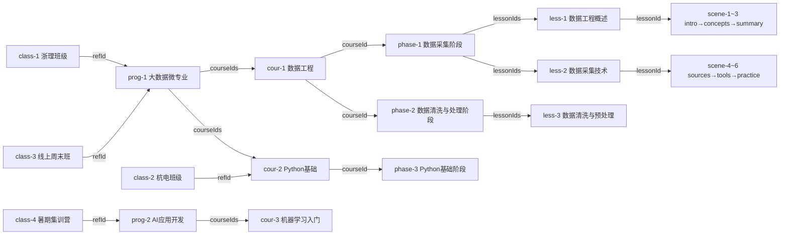

# Fixtures

模拟数据，用于开发、测试和演示。

## 资源关系

## 文件

| 文件 | 内容 |
|------|------|
| `programs.json` | 3 个专业（含空专业） |
| `courses.json` | 3 门课程 |
| `phases.json` | 4 个阶段，覆盖 3 门课程 |
| `lessons.json` | 8 个课时，部分含入口场景 |
| `scenes.json` | 10 个场景，含分支/终结/汇聚节点 |
| `classes.json` | 4 个班级，引用不同专业/课程 |
